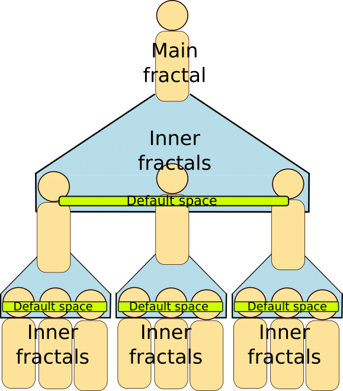

# Sierpinski's fractals demo

This demo is about Sierpinski's fractals. Those are 3 triangles inside a triangle.

## Launching the demonstration

* From SARL ID:
  1. Create a launch configuration of type "SARL Application"
  2. As the main class, select `io.sarl.demos.sierpinskiFractals.SierpinskiFractals`
* From command-line interface:
  1. Launch the application as a standard Java program.

## Description of the software

In the Sierpinski's fractals, there are 3 triangles inside a triangle.



To create this demo, only one agent was required. The idea is to create a main agent and then create 3 other agents in the inner context of the main agent. Then the main agent becomes an event broadcaster and so on and so forth for each fractals newly created.


```sarl
agent Fractal {
	...

	on Initialize {
		if (occurrence.parameters.size >= 2){
			// If initialized with arguments

			screenSurface = occurrence.parameters.get(0) as Square
			positions = occurrence.parameters.get(1) as Positions

			if (occurrence.parameters.size.equals(3)){
				// If initialized by the GUI
				var ctrl = occurrence.parameters.get(2) as FXMLViewerController
				guiSpace =  defaultContext.createSpace(
					OpenEventSpaceSpecification, UUID.randomUUID)
				ctrl.setGUISpace(guiSpace)
				guiSpace.register(asEventListener)
			}
		} else {
			// If initialized without argument
			screenSurface = new Square
			positions = new Positions
		}
		screenWidth = screenSurface.width
		this.generatePoints
	}

	...

}
```


## MVC pattern

This application follows a MVC (Model-View-Controller) pattern for the GUI communication.


## Code

[**Code on GitHub**](https://github.com/sarl/sarl/tree/master/contribs/io.sarl.examples/io.sarl.examples.plugin/projects/io-sarl-demos-sierpinskifractals)

